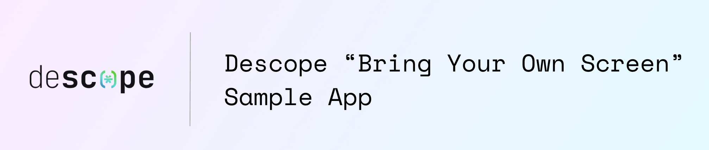

# Descope's Bring Your Own Screen Sample App

Welcome to Descope's Bring Your Own Screen Sample App, a demonstration of how to integrate Descope flows with custom screens within a Next.js application using the App Router.

## Overview

This project demonstrates Descope's "Bring Your Own Screen" (BYOS) feature, which allows developers to:
- Customize the entire authentication UI while leveraging Descope flows and session management
- Maintain full control over the user experience and design
- Integrate authentication flows seamlessly into existing applications
- Use pre-built components or create custom ones
- Handle authentication states and transitions with ease

## Features

### Authentication Flow
The implementation includes a complete authentication flow with custom screens:

- **Email Input Screen** (`EmailInput.tsx`) - Collects user email address
- **Magic Link Sent Screen** (`MagicLinkSent.tsx`) - Confirms magic link has been sent
- **OTP Verification Screen** (`OtpVerification.tsx`) - Handles OTP verification (if enabled)
- **User Information Screen** (`UserNamePrompt.tsx`) - Collects user's full name for new users
- **Auth Success Screen** (`AuthSuccess.tsx`) - Displays success message after authentication

### Dashboard
- **Protected Dashboard** (`/dashboard`) - Authenticated user dashboard with logout functionality
- **Dashboard UI** (`DashboardUI.tsx`) - Custom dashboard interface with user information

## Technology Stack

- **Framework**: Next.js 15 with App Router
- **Authentication**: Descope Next.js SDK
- **Styling**: Tailwind CSS with custom components
- **UI Components**: Radix UI primitives
- **Form Handling**: React Hook Form with Zod validation

## Project Structure

```
byos-sample-app/
├── app/
│   ├── dashboard/
│   │   └── page.tsx          # Protected dashboard page
│   ├── globals.css           # Global styles
│   ├── layout.tsx            # Root layout
│   └── page.tsx              # Home page with AuthFlow
├── components/
│   ├── AuthFlow.tsx          # Main authentication flow orchestrator
│   ├── EmailInput.tsx        # Email collection screen
│   ├── MagicLinkSent.tsx     # Magic link confirmation screen
│   ├── OtpVerification.tsx   # OTP verification screen
│   ├── UserNamePrompt.tsx    # User name collection screen
│   ├── AuthSuccess.tsx       # Success screen
│   ├── DashboardUI.tsx       # Dashboard interface
│   └── theme-provider.tsx    # Theme context provider
├── hooks/                    # Custom React hooks
├── lib/                      # Utility functions
└── middleware.ts             # Next.js middleware for route protection
```

## Getting Started

1. **Install dependencies**:
   ```bash
   pnpm install
   ```

2. **Configure Descope**:
   - Set up your Descope project in the Descope console
   - Configure the "sign-up-or-in-magic-link" flow (can use the template)
   - Add your Descope project ID to the environment variables

3. **Run the development server**:
   ```bash
   npm dev
   ```

4. **Open your browser** and navigate to `http://localhost:3000`

## BYOS Implementation Details

The core BYOS functionality is implemented in `AuthFlow.tsx`:

- **Flow Integration**: Uses Descope's `flowId="sign-up-or-in-magic-link"`
- **Screen Detection**: `onScreenUpdate` callback determines when to use custom screens
- **State Management**: Maintains form state between screens using React state
- **Interaction IDs**: Each screen transition uses specific interaction IDs from the flow builder

## Key Components

### AuthFlow.tsx
The main orchestrator that:
- Manages the authentication flow state
- Handles screen transitions
- Integrates with Descope's flow system
- Maintains form data between screens

### Custom Screen Components
Each custom screen component:
- Receives flow state and callbacks as props
- Handles user input and validation
- Calls the appropriate interaction ID to proceed
- Maintains consistent UI/UX with the rest of the application

## Environment Variables

Create a `.env.local` file with:
```
DESCOPE_PROJECT_ID=your_descope_project_id
```

## Learn More

- [Descope Documentation](https://docs.descope.com/)